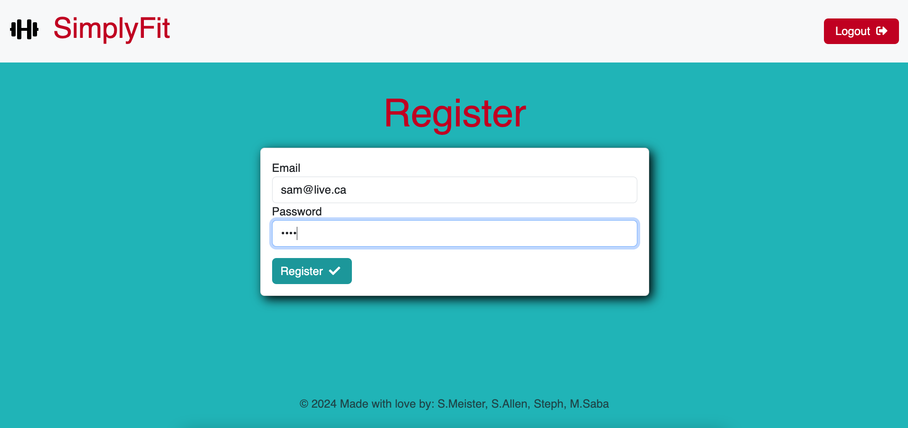
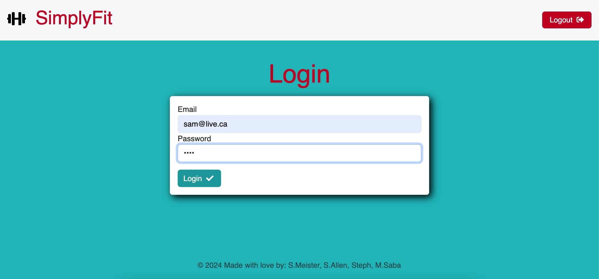
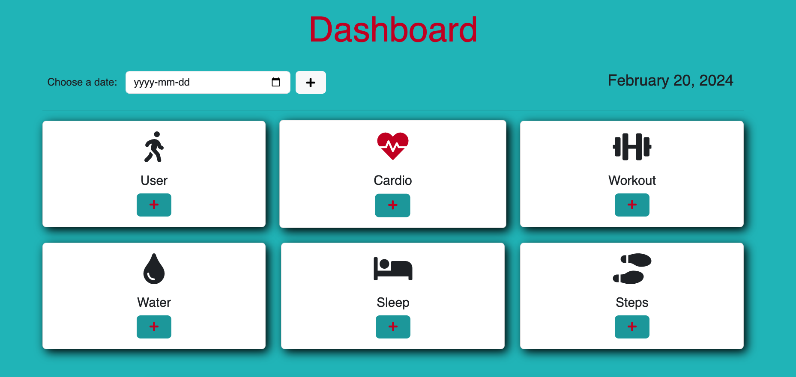

# Fitness Tracker MVC

Live URL 👇🏼 

## Description

As a fitness enthusiast, I want a comprehensive fitness tracker that allows me to log various types of workouts, track my water intake, and monitor my daily steps, so that I can have a detailed overview of my fitness progress and health habits to better achieve my personal health goals.

## Table of Contents

- [Installation](#installation)
- [Usage](#usage)
- [Credits](#credits)
- [License](#license)

## Installation

Clone or download the repo. Remove '.Example' from the .env file and add your credentials for mySQL inside the .env file. In the root directory run `npm install` to initialize and install dependencies. Run `npm run create` to initialize and set up the database. Run `npm run start` to start the application.

## Usage

Once the application is loaded, the home page will be the start of your fitness journey 

 

From the homescreen, if you are a new user you will click register to take you to anmother page where you can choose your username and password. If you are a returning user, then you will click the log in button to take you to a page with inputs to enter your existing credentials 

 
 

Once logged in, you will be redirected to the dashboard, where you can see 6 cards. One for your profile data and 5 others to log cardio, workout, sleep, water and step 

 

When you click the button to add user data, you can enter your height and weight 

 

If you click the user card, you will see your username, your height and weight and then your calculated BMI 

 

When you want to log something like a cardio workout, when you click the add button 3 input fields will appear in a modal: Exercise, Distance in KM, Time in minutes 

 

After you log your cardio workout, an encouraging message wil display at the bottom of the screen 

 

If you click the cardio card outside of the button you can see your logged exercise. If you want to delete it, there is a checkbox beside your entry and a delete buttom at the botton 

 

Workout, Water, Sleep and Steps all have the same functionalities and come with encouraging messages also! Lastly, when you are all finished, you can log out of your account with the logout button on the top right of the dashboard 

## Credits

Maika Sabo, Stephanie Perroni, Samantha Allen, Shawn Meister
W3Schools, MDN Web Docs and edX Bootcamp resources were invaluable for completing this project.

## License

The MIT License is short and to the point. It lets people do almost anything they want with your project, like making and distributing closed source versions.